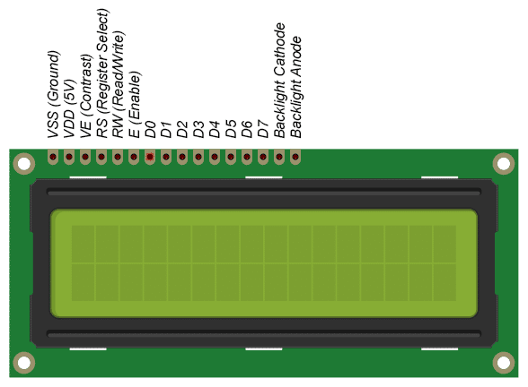

# 16x2 LCD Project
A C implementation for writing text to a 16x2 LCD display.

Research information gathered from:

* [Interfacing 16x2 LCD with RaspberryPi](https://www.iotstarters.com/interfacing-16x2-lcd-with-raspberry-pi/)
* [LCD specs](https://panda-bg.com/datasheet/2134-091834-LCD-module-TC1602D-02WA0-16x2-STN.pdf)

This project is intended to be used as a learning tool.
No guarantee is being made for its suitability for any particular purpose.

## Pinout for the LCD display:

---

---

# I'm Using GitHub Under Protest

This project is currently hosted on GitHub.  This is not ideal; GitHub is a proprietary,  
trade-secret system that is not Free and Open Souce Software (FOSS).  
I am deeply concerned about using a proprietary system like GitHub to develop my FOSS project.  
I urge you to read about the
[Give up GitHub](https://GiveUpGitHub.org) campaign from
[the Software Freedom Conservancy](https://sfconservancy.org)  
to understand some of the reasons why GitHub is not a good place to host FOSS projects.

Any use of this project's code by GitHub Copilot, past or present, is done without my permission.  
I do not consent to GitHub's use of this project's code in Copilot.

I plan to move this project to another hosting site (TBD) and will leave a link to it here in this README file.

---

